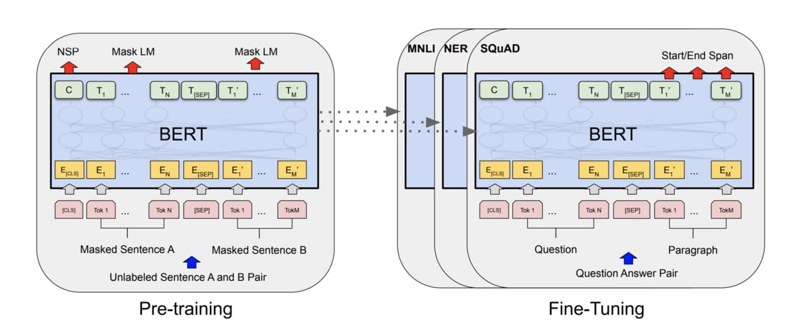

### BERT Sentiment Analysis

Single sequence classification task for sentiment analysis

#### See also

* [My BERT seniment analysis video](https://www.linkedin.com/posts/joseph-huang-793541167_i-trained-an-nlp-model-to-predict-the-sentiment-activity-6628126347137028096-3Et9)
* [Transformer](https://youtu.be/ugWDIIOHtPA)
* [ELMO, BERT, GPT2](https://youtu.be/UYPa347-DdE)
